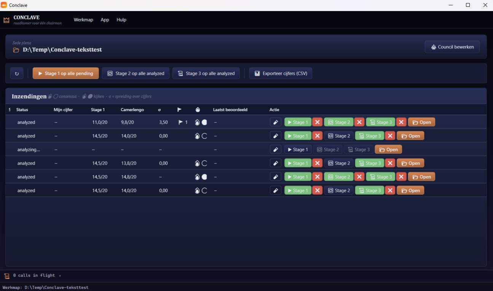

# Conclave

**Een council van LLM's die je helpt bij het beoordelen van programmeer- en schrijfopdrachten.**
WPF-desktoptool voor Windows. Jij bent chairman, de AI's geven advies — het eindoordeel ligt altijd bij jou.

> *Een conclave is een afgesloten ruimte waar raadgevers beraadslagen tot er witte rook is. De raad geeft advies — de eindbeslissing ligt bij één persoon.*



---

## Wat doet deze tool?

Je hebt een stapel van 50 student-folders met dezelfde opdracht. Conclave laat 2 à 3 LLM's onafhankelijk elke inzending lezen, vergelijkt hun oordelen, en geeft jou een dashboard waar je per student in seconden ziet:

- 📊 **Voorgesteld cijfer** per AI + gewogen Camerlengo-advies
- 🔥⚪ **Witte rook** wanneer alle AI's het eens zijn — kandidaat voor snelle accept
- 🔥⚫ **Zwarte rook** wanneer ze van mening verschillen — daar moet jij naar kijken
- 🚩 **Rode vlaggen** met klikbare code-snippets die je naar de juiste regel brengen
- 🤖 **AI-vermoeden** wanneer iets verdacht naar Copilot ruikt
- 📁 **Diff** tegen je modeloplossing per bestand

Vervolgens vul jij het cijfer in, exporteert een CSV en bent klaar.

### Welke opdrachten?

| Type | Wat | Bestanden |
|---|---|---|
| **C#** | .NET-projecten, eindopdracht Programmeren | `.cs`, `.csproj` |
| **Generic code** | Python, Java, C++, … | configureerbare extensies |
| **Web** | HTML/CSS/JS/TS-projecten | `.html .css .js .ts` (negeert `node_modules/`, `dist/`) |
| **SQL** | DDL/DML-opdrachten | `.sql` |
| **Writing** | Schrijfopdrachten, verslagen, essays | `.md`, `.docx`, `.pdf` |

Bij het openen van een nieuwe werkmap detecteert de tool het type en stelt het je voor; je bevestigt of kiest een ander type.

---

## Installatie

### Vereisten

- **Windows 10/11**
- **.NET 10 SDK** — [download](https://dotnet.microsoft.com/download/dotnet/10.0)
- Minstens één API-key voor een LLM-provider (zie hieronder)

### Bouwen

```powershell
git clone <repo-url>
cd Conclave
dotnet build Conclave.sln -c Release
dotnet run --project src/Conclave.App
```

### API-keys configureren

Conclave praat default met **OpenRouter** (één key, toegang tot 200+ modellen — Claude, GPT, Gemini, DeepSeek, …). Optioneel kun je ook directe Anthropic/OpenAI keys gebruiken.

Drie manieren, in volgorde van precedentie:

1. **Via de tool zelf** *(aanbevolen)*: menu **App → App-instellingen…**, vul keys in, herstart. Bewaard in `%APPDATA%\Conclave\user-settings.json`.
2. **Via `appsettings.local.json`** *(handig voor debug)*: kopieer in `src/Conclave.App/`, gitignored. Wint van app-instellingen.
3. **Via environment variables**: `CONCLAVE_OPENROUTER__APIKEY`, `CONCLAVE_ANTHROPIC__APIKEY`, etc.

> 💡 **Gratis pilot-run?** Maak een OpenRouter-account aan en gebruik `:free`-modellen (DeepSeek, Qwen3-Coder, …) — geen kost. In de Council Editor staat een "alleen gratis"-filter.

---

## Een werkmap opzetten

Per opdracht heb je één werkmap met de student-folders erin. Conclave maakt een aparte `_conclave/`-folder ernaast voor alle tool-data; de student-folders blijven volledig onaangeraakt.

```
2026-prog2-eindopdracht\
├── _conclave\              ← Conclave schrijft hier alles
├── Jansen_Pieter\          ← read-only bron
├── DeSmet_Lara\
└── VanDenBergh_Mohammed\
```

### Eerste keer openen

1. **App → Werkmap openen…** → wijs de bovenliggende folder aan
2. **Type kiezen** — de tool stelt op basis van de inhoud een type voor (C# / Python / web / SQL / writing). Bevestig of kies anders.
3. **Vul `_conclave/` in:**
   - `opdracht.md` — opdrachtomschrijving
   - `rubric.md` — criteria + gewichten
   - `modeloplossing/` — jouw referentie-oplossing
   - `students.json` — naam ↔ pseudoniem (tool maakt template)
4. **Council samenstellen** — knop **Edit Council** opent een venster met live model-comparer (kost + kwaliteit + free-only filter). Aanbevolen: 3 leden uit verschillende modelfamilies.

> ⚠️ **Belangrijk:** Bronfolders zijn **read-only** voor de tool. Conclave raakt nooit een student-bestand aan. Alle tool-data leeft in `_conclave/`. Je kunt veilig een student-folder vervangen bij heroplevering — je werk gaat niet verloren.

---

## Dagelijkse flow

### Dashboard

Tabel met alle inzendingen, default gesorteerd op **spreiding (σ) aflopend** — daar zit jouw toegevoegde waarde.

| Student | Status | Stage 1 | Camerlengo | σ | 🚩 | Mijn cijfer |
|---|---|---|---|---|---|---|
| VanDenBergh_M | analyzed | 11.7/20 | 11.2/20 | **3.2** 🔥⚫ | 4 | – |
| Jansen_P | analyzed | 14.3/20 | 14.5/20 | 0.9 🔥⚪ | 1 | – |
| DeSmet_L | judged | 15.0/20 | 15.1/20 | 0.5 🔥⚪ | 0 | 15.0 |

**Acties:**
- **Run stage 1 op alle pending** — elk lid analyseert onafhankelijk
- **Run stage 2** — geanonimiseerde cross-review (wordt automatisch overgeslagen bij consensus)
- **Run stage 3** — optionele Camerlengo-nota met meta-observaties + adviserend cijfer
- **Exporteer cijfers (CSV)** — Excel-friendly export voor je administratie

### Project-view (per student)

Split-screen met code-browser links (klikbare bevindingen springen naar de juiste regel), council-output rechts, en een **Diff-tab** tegen de modeloplossing.

**Sneltoetsen:**

| Toets | Actie |
|---|---|
| `J` / `K` | Vorige / volgende student |
| `Enter` | Oordeel opslaan + door naar volgende |
| `A` | Accept council-cijfer (alleen bij hoge consensus) |
| `F` | Flag voor latere review |
| `Ctrl+L` | Live log-paneel openen / sluiten |
| `?` | Help-overlay |

### Live observability tijdens een run

Onderaan zit een inklapbaar log-paneel dat per call toont: stage, lid, model, latency, tokens, kost. Klikken op een regel opent het volledige transcript (system-prompt + user-prompt + response of error). Bij timeout / API-fout popt het paneel automatisch open.

---

## Hoe werkt de council?

Drie stages, met automatische skip-logica om kosten te besparen.

**Stage 1 — First opinions.** Elk lid krijgt onafhankelijk: opdracht, rubric, modeloplossing, studentwerk. Output is markdown met cijfer, rubric-scores, rode vlaggen (met letterlijke snippets), en AI-vermoeden.

**Stage 2 — Cross-review (geanonimiseerd).** Elk lid leest de andere antwoorden als Reviewer A/B/C en zoekt observaties die niet kloppen. **Wordt overgeslagen** als de cijfers dicht bij elkaar liggen (σ ≤ drempel) en geen high-severity vlaggen — bespaart kost op routine-cases.

**Stage 3 — Camerlengo-nota (optioneel).** Een aparte chairman-AI levert meta-observaties ("waar is het meeste meningsverschil?", "wat zou je concreet moeten checken?") plus een eigen adviserend cijfer. Gewogen mix met de stage-1 cijfers verschijnt in de **Camerlengo**-kolom.

> Witte rook 🔥⚪ = consensus, snelle review. Zwarte rook 🔥⚫ = zelf kijken.

---

## Privacy & veiligheid

- **Pseudonimisering**: studentnamen worden vervangen via `_conclave/students.json` vóór elke API-call. De UI toont gewoon de echte naam.
- **API-keys**: nooit in git — ofwel via App-instellingen (`%APPDATA%`), ofwel via `appsettings.local.json` (gitignored).
- **Lokaal**: alle tool-data leeft op disk. Niets gaat naar een cloud die wij beheren. Wat naar OpenAI / Anthropic / OpenRouter gaat is uitsluitend de gepseudonimiseerde prompt op het moment van de call.
- **Logbestanden** (`_conclave/analyses/<student>/log.jsonl`) bevatten alleen tokens/kost/latency — geen prompts of responses. Volledige prompts en responses staan in `transcripts/`-folder, leesbaar zonder de tool.

---

## Wat als…

**…ik een student-folder vervang met een nieuwe inzending?** Bron-hash wijzigt → status wordt automatisch `stale`. Open de student in het dashboard en run opnieuw.

**…ik het opdracht-type wil veranderen achteraf?** Werkmap-instellingen → "Opdracht-type wijzigen…". Reeds geanalyseerde inzendingen worden automatisch als `stale` gemarkeerd.

**…een API-call timeout-t of faalt?** Default 3-min deadline per call. De tool schrijft een failure-transcript zodat je achteraf ziet waarom het misging. Andere council-leden gaan gewoon door — één hangend lid blokkeert nooit de hele stapel.

**…ik geen `council.json` heb?** De tool valt terug op een default (1 lid). Je krijgt een duidelijke waarschuwing met provider + model voordat er ook maar één API-call gaat. Drie opties: doorgaan / Council Editor openen / annuleren.

**…ik geen modeloplossing heb?** De tool weigert te starten ("Sede vacante"-melding). Vul `_conclave/modeloplossing/` aan en herlaad.

---

## Folder-structuur na een run

```
_conclave/
├── .conclave-config.json       ← markeert dit als werkmap, opdracht-type
├── opdracht.md, rubric.md
├── council.json                ← council-configuratie
├── modeloplossing/             ← jouw referentie
├── prompts/                    ← stage-prompts (aanpasbaar)
├── students.json               ← naam ↔ pseudoniem
├── extracted/                  ← gecachte tekst-extractie (.docx/.pdf → .md)
├── analyses/Jansen_Pieter/
│   ├── council/
│   │   ├── 01-first-opinions/   ← stage 1 markdown per lid
│   │   ├── 02-cross-review/     ← stage 2 (anoniem)
│   │   ├── 03-chairman-sidenote.md
│   │   └── transcripts/         ← per call: prompts + response + meta
│   ├── tim-oordeel.md
│   ├── metadata.json            ← hash, status, cijfer
│   └── log.jsonl                ← tokens/kost/latency
└── runs/                        ← cross-project rapporten (M4)
```

Alles markdown / JSON op disk. Leesbaar zonder de tool. Git-baar. Grep-baar.

---

## Harde principes

1. **Bronfolders zijn read-only.** De tool schrijft uitsluitend in `_conclave/`.
2. **Geen AI bepaalt het bindende eindoordeel.** De council geeft advies; jij beslist.
3. **Pseudonimisering vóór elke API-call.**
4. **Markdown is de waarheid.** Alle resultaten leesbaar zonder de tool.
5. **API-keys nooit in git.**

---

## Meer weten?

- **Architectuur & ontwerpkeuzes**: [docs/architectuur.md](docs/architectuur.md)
- **Project-instructies voor bijdragers**: [CLAUDE.md](CLAUDE.md)
- **Roadmap & openstaande punten**: [TODOnext.md](TODOnext.md)

---

## Terminologie

| Concept | Term |
|---|---|
| Council-lid | Cardinal |
| Stage-1-ronde | Ballotage |
| Consensus, geen vlaggen | Witte rook 🔥⚪ |
| Conflict / hoge spreiding | Zwarte rook 🔥⚫ |
| Oordeel opgeslagen | Habemus iudicium |
| Stapel afgerond | Habemus papam |
| Werkmap zonder modeloplossing | Sede vacante |
| AI-chairman-nota | Camerlengo-nota |

